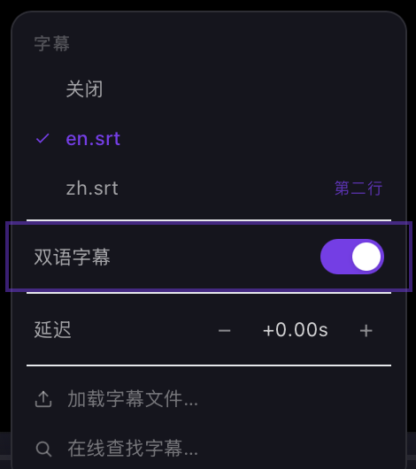

# macOS 实机验证记录

这个文件存在的理由，和 ROADMAP 里那张记账表一样：说清楚**哪些功能在 macOS 上
真的被人用眼睛（或者用 `dev snapshot`）看过**，哪些只是「编译过了、headless 测
试全绿」。

在这次之前，unflick 的每一条 GUI 功能验证都是在 Windows 上做的，靠 PrintWindow +
PostMessage 驱动窗口。macOS 一条都没验过。这次是 `unflick dev` 桥第一次真正被用起来。

## 环境

```
macOS 25.6.0 (Darwin)，Apple Silicon
worktree:  /Volumes/Dev/code/unflick-wt-verify   (track/macos-verification)
binary:    src-tauri/target/debug/unflick  —  cargo build --features custom-protocol
```

`custom-protocol` 不是可选的。第一次构建没带 `dist/`（还没跑 `pnpm build`），
`tauri-build` 的 proc macro 直接 panic：

```
error: proc macro panicked
error: could not compile `unflick` (lib) due to 1 previous error; 6 warnings emitted
```

先 `pnpm build` 再 `cargo build --features custom-protocol`，42 秒。

驱动窗口全程用独立环境，不碰用户真在看的那个播放器：

```bash
export UNFLICK_CONTROL_ADDR=127.0.0.1:29821
export UNFLICK_DATA_DIR=/tmp/uf-verify-d
export UNFLICK_CONFIG_DIR=/tmp/uf-verify-c
export UNFLICK_LOG=/tmp/uf-verify-c/startup.log
```

## 先记下来的一件事：窗口不在屏幕上时，看到的是「一切都不可见」

`unflick --allow-dev` 起来之后第一件事是找首启引导卡，结果：

```
$ unflick dev wait '[role="dialog"]' --timeout 5
{
  "success": false,
  "message": "gave up after 7180 ms — 1 match(es) for [role=\"dialog\"] are in the page but none is visible"
}
```

**在页面里，但不可见。** 追下去：

```
$ unflick dev eval 'JSON.stringify({hidden: document.hidden, vis: document.visibilityState, rAF: typeof requestAnimationFrame})'
{"hidden":true,"vis":"hidden","rAF":"function"}

$ unflick dev eval 'var d=document.querySelector("[role=\"dialog\"]"); var cs=getComputedStyle(d); …'
{"label":"为人类和 AI 打造的视频播放器","opacity":"0","visibility":"visible",
 "transform":"matrix(0.96, 0, 0, 0.96, 0, 0)","rect":[262.4,53.1,499.2,533.8],"parentOpacity":"0"}
```

`opacity: 0`、`scale: 0.96` —— 正是 Framer Motion 的 `initial`。窗口是隐藏的
（`document.hidden === true`），动画帧被挂起，**入场动画永远停在第一帧**。

dev_probe.js 的 `hiddenNote()` 已经把这件事写在**退场**动画上了（`wait --gone`
等不到）。但它对**入场**同样成立，而且后果更重：窗口没在前台的话，
`AnimatePresence` 挂载的每一个面板（字幕菜单、书签、均衡器……）都是 opacity 0，
`dev click` 会按「不可见」拒绝，整轮验证会变成一串假阴性。

屏幕**没有**锁（`ioreg -n Root -d1 -a` 里没有 `CGSSessionScreenIsLocked`）——
窗口只是没在前台。把它提到前台之后就正常了：

```bash
osascript -e "tell application \"System Events\" to set frontmost of (first process whose unix id is $PID) to true"
```

```
$ unflick dev eval 'JSON.stringify({hidden: document.hidden, vis: document.visibilityState})'
{"hidden":false,"vis":"visible"}
```

所以本次所有涉及面板 / 弹层的验证，都是在窗口置顶之后做的。

> `dev capture` 在窗口不可见时的拒绝是**对的**，不是故障：
> ```
> the window did not produce a snapshot within 10s. WebKit holds a snapshot back
> until the window next draws, and a window that is covered, on another Space, or
> minimised may never draw. Bring the unflick window to the front and retry.
> ```

---

## 桥本身：能用

```
$ unflick dev wait "body" --timeout 30
{"success": true, "message": "body appeared after 29 ms", …}

$ unflick dev eval "document.title"
{"success": true, "message": "unflick", "data": {"value": "unflick"}}

$ unflick dev snapshot --depth 8
{"success": true, "message": "38 node(s)", …}
```

snapshot 给出的选择器是能回喂给 `dev click` 的完整路径，例如
`body > div > div > div:nth-of-type(4) > div:nth-of-type(2) > div:nth-of-type(1) > button`
（名字 `媒体库 (L)`，role `button`）。界面是 zh-CN。

---

## 首启引导（v0.14，落地当天从没上过屏）

**结论：通过。**

### 卡片确实只在该出现的时候出现

全新 config 目录 + 不带文件启动，卡片在：

```
$ unflick dev text '[role="dialog"]'
"text": "unflick\n为人类和 AI 打造的视频播放器\n几乎什么都能打开——本地文件、已挂载的网络共享、串流链接。解码交给 mpv，编解码器不再是你的问题。\n打开文件\n……或把文件拖到窗口任意位置\n先记住这三个键\n\nSpace\n播放 / 暂停\n→\n快进\nF\n全屏\n没有窗口时它照样能跑\nunflick 自带命令行工具和 MCP 服务器。这个窗口能做的事，脚本或 AI 助手同样能做。\nunflick play <file>\n在 Claude Code 里，两行就够：\n/plugin marketplace add zhitongblog/unflick\n/plugin install unflick\n复制\n跳过\n开始观看"
"visible": true
```

`dev capture` 出的图（2048×1280）确认了排版：logo + 标题、三个键帽
（Space / → / F，走的是 `formatKey`，不是硬编码）、CLI/MCP 那一块、右下角
「跳过」「开始观看」。**没有一个节点叫 "undefined"。**

### 四条退出路径，条条都落盘

每条都验了两件事：卡片消失，且 `onboarding_seen` 从 CLI 读出来是 `true`
——窗口和 CLI 两个真相来源对上。

| 路径 | 命令 | 卡片 | `settings get --key onboarding_seen` |
|---|---|---|---|
| Esc | `dev eval 'document.dispatchEvent(new KeyboardEvent("keydown",{key:"Escape",bubbles:true}))'` | `left the page after 2 ms` | `true` |
| 跳过 | `dev click '[role="dialog"] button' --index 2` → `clicked button.rounded-lg.px-3 "跳过"` | `left the page after 2 ms` | `true` |
| 开始观看 | `dev click '[role="dialog"] button' --index 3` → `clicked button.rounded-lg.border "开始观看"` | `left the page after 5 ms` | `true` |
| 点遮罩 | 在 overlay 的 `(left+8, top+8)` 派发 mousedown/mouseup/click | `left the page after 2 ms` | `true` |

Esc 那条之后 settings.json 的全部内容就是：

```json
{
  "onboarding_seen": true
}
```

### 重新武装、以及不再回来

```
$ unflick settings set onboarding_seen false
{"success": true, "message": "set onboarding_seen", "data": {"key": "onboarding_seen", "value": false}}
```

配合 `location.reload()`，卡片每次都回来（`rearmed: True`，四轮里用了三轮）。
不重新武装就重启，卡片不回来：

```
### restart with onboarding_seen=true, no file
launched pid=31869 visible=true
$ unflick dev eval 'JSON.stringify({dialogs: document.querySelectorAll("[role=\"dialog\"]").length})'
{"dialogs":0}
```

### 一个值得单独记的正确行为：带着文件启动，标志不被消费

`onboarding_seen` 置回 false，然后带着 selftest.mp4 启动：

```
### re-arm, restart WITH a file — card must stay away
launched pid=34308 visible=true
{"dialogs":0}
  state: playing file: atchpad/selftest.mp4 dur: 20.0
  onboarding_seen still: False
```

卡片没出（`shouldShowOnboarding` 里 `playerState !== "stopped"` 那条），**而且
标志没有被顺手写成 true**。也就是说：从 Finder 双击一个片子第一次用 unflick 的
人，下次空手打开播放器时，引导还在等他。这条如果写反了，是那种没人会发现的 bug。

---

## 双语字幕（v0.14，落地当天从没上过屏）

**结论：通过，而且是这次验证里证据最硬的一条**（真窗口合成后的像素）。

### 先撞上一件不是 bug 的事

第一次试的时候，我用 CLI 加载了两个字幕文件，然后打开 GUI 的字幕菜单：

```
$ unflick subtitle list
  id=1 orig.srt  selected=false
  id=2 zh.srt    selected=true

$ unflick dev text '.glass-elevated'
字幕
没有加载字幕轨。          ← 菜单说一条都没有
延迟 − +0.00s +
加载字幕文件… / 在线查找字幕…
```

看着像经典的「列表没走到打开的面板里」。但不是：`playerStore` 的轮询只在
**文件变了**的时候重拉字幕轨（`if (s.file !== previousFile) … refreshSubtitles()`），
同一个文件上从 CLI 加载的轨道不会推给窗口。这是有意的，代码里写着。所以这条不
记为缺陷——但它确实意味着：**在同一个文件上用 CLI/MCP 加字幕，窗口菜单不会更新，
要切一次文件。** 记在这里，因为下一个从外面驱动窗口的人一定会再撞一次。

按它设计的路走（sidecar 放在视频旁边，换文件触发轮询）之后，菜单是对的：

```
$ unflick subtitle list
  id=1 title=en.srt selected=False secondary=False
  id=2 title=zh.srt selected=True  secondary=False

$ unflick dev text '.glass-elevated'
字幕
关闭
en.srt
zh.srt
双语字幕
延迟 − +0.00s +
加载字幕文件… / 在线查找字幕…
```

两条轨道、标题一致、**没有一个是 "undefined"** —— Windows 那次音轨菜单全是
"undefined" 的同类 bug，在 macOS 的字幕菜单上不存在。

### 开关真的驱动了后端

```
$ unflick dev snapshot --selector '[role="switch"]'
{"name": "同时显示原文和译文", "role": "switch", "state": {"checked": false}}

$ unflick subtitle bilingual
"message": "bilingual off"
"primary": {"id": 2, "label": "bili.zh.srt", "lang": "zh"}, "secondary": null

$ unflick dev click '[role="switch"]'
clicked button.flex.w-full "同时显示原文和译文"

$ unflick dev snapshot --selector '[role="switch"]'
{"name": "同时显示原文和译文", "role": "switch", "state": {"checked": true, "focused": true}}

$ unflick subtitle bilingual
"message": "bilingual on: bili.en.srt + bili.zh.srt"
"primary":   {"id": 1, "label": "bili.en.srt", "lang": "en"}
"secondary": {"id": 2, "label": "bili.zh.srt", "lang": "zh"}
"layout": "stacked",  "sub_pos": 100.0,  "secondary_sub_pos": 94.5
```

窗口的 `aria-checked` 和 CLI 读出来的 `enabled` 两边对上，主轨/副轨也对上。

### 两行真的叠在屏幕上 —— 这条只能用真像素证

`unflick screenshot` 证不了。它要的是干净的画面层：

```rust
// core/player.rs:475
self.mpv.command(&["screenshot-to-file", path, "video"])
```

`"video"` 就是「不含字幕和 OSD」，所以截出来的 20 秒测试片是彩条，一个字都没有。
`dev capture` 也证不了——它拿的是 WKWebView 那一层，而 mpv 在 macOS 上画在自己的
子窗口里。**两个内置工具都到不了这个问题**。

屏幕当时没锁、窗口在前台，所以用 `screencapture` 抓了真实合成后的窗口，裁出字幕带：


上面一行 `原文那一行`（zh，secondary，`secondary_sub_pos` 94.5），下面一行
`The original line`（en，primary，`sub_pos` 100）。**不重叠，确实是两条带。**
bilingual.rs 里那句「mpv 不会自己叠，`secondary-sub-pos` 等于 `sub-pos` 时会塌成
一条」——叠加的算术在 macOS 上是对的。

菜单本身也一起进了这张图：



`en.srt` 前面是对勾（选中的那条），`zh.srt` 右边是 `第二行` 角标（副轨用角标而不是
对勾，因为它不是「选中」的意思），`双语字幕` 开关是开的。

### 落盘，以及换文件自动重新武装

```json
// /tmp/uf-verify-c/settings.json
{
  "onboarding_seen": false,
  "subtitle_bilingual": { "enabled": true, "layout": "stacked" }
}
```

换一个带自己 sidecar 的新文件（second.mp4 + second.en.srt + second.zh.srt）：

```
$ unflick play /tmp/uf-verify-media/second.mp4
$ unflick subtitle bilingual
  bilingual on: second.en.srt + second.zh.srt
  enabled True primary second.en.srt secondary second.zh.srt sub_pos 100.0 sec_pos 94.5
```

`after_play_hooks` 那条路在 macOS 上通的。而且**菜单自己跟上了**——文件换掉之后
菜单还开着，没有人碰它，开关读出来已经是 checked：

```
$ unflick dev snapshot --selector '[role="switch"]'
  switch: 同时显示原文和译文 checked= True
```

这正是 `refreshSubtitles` 里 `bilingual: mapped.some(t => t.secondary)` 那行在干的事。

从 GUI 关掉，一路通到底：

```
$ unflick dev click '[role="switch"]'   → clicked button.flex.w-full "同时显示原文和译文"
$ unflick subtitle bilingual            → bilingual off
$ cat settings.json                     → {"enabled": false, "layout": "stacked"}
```

---

## v0.11 #1 进度条缩略图预览（记账表里写了两版「仍未实机」的那条）

**结论：通过。** 而且是能拿到的最强证据——**窗口里那张图和 CLI 出的图逐字节相同**。

### 后端先通

CLI 那一半叫 `unflick frame thumbnail`（不是 `unflick thumbnail`）：

```
$ unflick frame thumbnail 8 --output /tmp/uf-verify-c/thumb8.png --width 160
{"success": true, "message": "preview at 8.0s → /tmp/uf-verify-c/thumb8.png",
 "data": {"bytes": 2911, "path": "…", "position": 8.0}}

$ file /tmp/uf-verify-c/thumb8.png
JPEG image data, JFIF standard 1.02, …, 160x90, components 3
```

> 顺带：`--output` 给什么名字就写什么名字，内容是 JPEG。上面这个 `.png` 里装的是
> JPEG。不影响功能（GUI 用的是 data URL，MIME 写对了），但 CLI 这一侧名字会骗人。

### 窗口这一半

进度条是 `div.group.relative.cursor-pointer`，在 `[80, 561, 864×19]`。派发
`mouseover` + `mousemove` 到 40% 处：

```
$ unflick dev eval '…fire("mouseover"); fire("mousemove")…'
{"firedAt":[426,571]}

$ unflick dev eval '…document.querySelectorAll("img")…'
[{"w":160,"natural":"160x90","src":"data:image/jpeg;base64,/9j/4AAQSkZJRgABA","vis":true}]

$ unflick dev text '.glass-elevated'
  visible True '0:07'
```

浮层出来了：一张 160×90 的 JPEG，底下一行时间 `0:07`。

时间对不对，算一遍：`clientX` 是整数，`80 + 864×0.4 = 425.6` 被截成 `425`，
`(425−80)/864 × 20s = 7.986s`，`formatTime` 向下取整 → `0:07`。对的。

### 两个真相来源，逐字节对上

把窗口里那张图的 data URL 解出来，和 CLI 在同一个 bucket 上生成的比：

```
GUI tooltip image: 2963 bytes  sha256 bdb47d30e4e767db
$ unflick frame thumbnail 7.7 --output … --width 160
  CLI bucket: 6.0  2963 bytes
CLI image:         2963 bytes  sha256 bdb47d30e4e767db
```

**同样 2963 字节，同样的 sha256。** 窗口显示的确实就是后端算出来的那一帧，
7.986s 落到 6.0s 这个 bucket——和 CLI 传 7.7 落到的 bucket 是同一个。

（那张图留在 `docs/verification-macos/thumbnail-tooltip-image.jpg`。）

---

## 中途：屏幕锁了，而 `dev capture` 的拒绝是对的

缩略图验完之后屏幕自动锁了。这件事本身值得记一笔，因为它是设计里明写的行为，
这是第一次在 macOS 上真的撞到：

```
$ python3 -c "…ioreg -n Root -d1 -a…"
CGSSessionScreenIsLocked present: True

$ unflick dev eval 'JSON.stringify({hidden:document.hidden, vis:document.visibilityState})'
{"hidden":true,"vis":"hidden"}

$ unflick dev capture --output /tmp/uf-verify-c/x.png
false — the screen is locked, so nothing is drawing the window and a capture would be
a black rectangle. Unlock the screen and retry; `unflick dev snapshot` a…
```

**按名字拒绝，说清楚为什么，并且指向还能用的那个命令。** 这是对的，不是故障。
同时 `dev eval` 照常工作（上面那三条命令都是锁屏之后跑的），DOM 还在
（`imgs: 1`，浮层没被拆掉）。

代价是真实的，要写在前面：**锁屏之后，这一轮剩下的所有面板都拿不到「长什么样」
这一半。** 窗口隐藏 → 没有动画帧 → Framer Motion 的入场动画停在 `initial`
（opacity 0）→ `dev click` 会按「不可见」拒绝，`dev wait` 也等不到。
所以下面每一条都会分开写清楚：**结构和行为**验到了什么，**外观**还欠谁一双眼睛。

---

## v0.11 #3 鼠标手势（记账表里「仍未实机」了两个版本，**任何平台**都没实机过）

**结论：滚轮音量有 bug，已修；其余全部通过；双击全屏在锁屏下测不了，`unverified`。**

默认绑定先从 CLI 读出来当基准（9 个触发器）：

```
$ unflick mouse list
  wheel_up → volume_up      wheel_down → volume_down
  click → play_pause        double_click → fullscreen    middle_click → play_pause
  gesture_left → seek_back  gesture_right → seek_forward
  gesture_up → volume_up    gesture_down → volume_down
```

所有事件都派发到视频区那个 div（`div.relative.flex.flex-1.items-center.justify-center.overflow-hidden`，
`[0, 28, 1024×528]`）——React 的 `onWheel` / `onMouseUp` 挂在它身上，派发到 `body`
是到不了的（事件只向上冒泡）。

### 🐞 找到的 bug：一次滚轮 N 步，音量只动一步

`lib/gesture.ts` 的累加器把一次 `deltaY` 换算成 N 步，handler 再按 N 次触发：

```js
const { steps, direction } = wheel.current.push(e.deltaY);
for (let i = 0; i < steps; i++) {
  runMouseTrigger(direction === "up" ? "wheel_up" : "wheel_down");
}
```

而 action 是：

```js
volume_up: () => setVolume(Math.min(150, volume + 5)),
volume_down: () => setVolume(Math.max(0, volume - 5)),
```

`volume` 是 App 上次渲染时捕获的值。循环里 N 次调用读到的是**同一个** `volume`，
算出**同一个**目标，最后一次写赢——**N 步等于 1 步**。

实测（每次都先 `volume 100`，只派发一个 wheel 事件）：

```
  deltaY=400  steps=10  expected=50  volume: 100 → 90
  deltaY=200  steps=5   expected=75  volume: 100 → 95
  deltaY=80   steps=2   expected=90  volume: 100 → 95
```

**一个鼠标滚轮刻度是 deltaY 120，也就是 3 步**，所以真实鼠标上每一格都只走了
三分之一。`gesture.test.ts` 全绿而且一直是对的——它断言累加器返回 10，它确实返回
10；被扔掉的是 handler 拿到 10 之后的事。这就是那种**编译通过、headless 全绿、
只有真窗口能看见**的 bug。

尝试用 monkey-patch `__TAURI_INTERNALS__.invoke` 数调用次数时撞到
`TypeError: Attempted to assign to readonly property.`——invoke 是只读的。
不影响结论：终值本身就够说明问题。

**修法**（`src/App.tsx`）：从 store 现读，不要用闭包里的。

```js
volume_up: () =>
  setVolume(Math.min(150, usePlayerStore.getState().volume + 5)),
volume_down: () =>
  setVolume(Math.max(0, usePlayerStore.getState().volume - 5)),
```

`setVolume` 在 await mpv 之前就同步 `set({volume})`，所以循环里下一步能看到上一步。
**同一个文件里的原生菜单分支（App.tsx:1058）本来就是这么写的**——这个修改只是让
鼠标那条路和它对齐，不是发明新写法。

修完实测，三个 delta 全部精确命中：

```
### AFTER THE FIX
  deltaY=200  steps=5   expected=75  volume: 100 → 75
  deltaY=400  steps=10  expected=50  volume: 100 → 50
  deltaY=80   steps=2   expected=90  volume: 100 → 90
```

**回归测试加在 `src-tauri/tests/gui_dev.rs`**，不是加在前端——只有开真窗口的那个
套件能看见这件事。新阶段：把音量设成 100，派发一个 `deltaY: 200` 的 wheel（5 步），
断言音量是 75；失败信息里写明「95 就是 stale-closure 那个 bug 只应用了一步」。

### 其余触发器：全部通过

| 手势 | 派发 | 结果 |
|---|---|---|
| 中键 → play_pause | `mouseup` button=1 | `playing` → `paused` → `playing`，来回都对 |
| 右拖右 → seek_forward | mousedown b=2 @cx，mouseup @cx+120 | `8.00 → 13.00`（+5） |
| 右拖左 → seek_back | mouseup @cx−120 | `13.00 → 8.00`（−5） |
| 右拖下 → volume_down | mouseup @cy+120 | `80 → 75` |
| 右拖上 → volume_up | mouseup @cy−120 | `75 → 80` |
| 20px 抖动 → **不算手势** | mouseup @cx+20 | 位置不变（`MIN_DISTANCE` 45 生效） |
| 对角 (85,85) → **什么都不做** | mouseup @cx+85,cy+85 | 音量不变（`AXIS_DOMINANCE` 生效） |

### 一个会骗人的测量陷阱，记下来给下一个人

第一轮右拖「没反应」（8.00 → 8.00），差点记成 bug。真相是：**窗口隐藏时 WebKit
会狠狠限流定时器**，250ms 的状态轮询几乎停了，所以我用 CLI `seek 10` 之后，窗口
里的 store 还停在 5——而 `seek_forward` 是 `seek(position + 5)`，用的是 store 的值，
于是算出 10，和当前位置一模一样，看起来「什么都没发生」。

窗口自己的标签能直接看出这件事：

```
  CLI pos: 8.00   UI shows: 0:05 | 0:20 | 65
```

所以上表每一行都是先等窗口的标签和 CLI 对齐（`sync` / `syncvol`）再派发的。
**用 CLI 改状态、再用窗口验效果，在锁屏下需要显式同步**，否则测的是限流。

### 双击全屏：`unverified`（锁屏）

双击确实走到了 handler，`set_fullscreen` 也确实被调到并且返回成功：

```
$ dev eval 'window.__TAURI_INTERNALS__.invoke("set_fullscreen")…'
  result: ok:{"fullscreen":true}
```

但窗口**没有真的全屏**：

```
  geom before: {"iw":1024,"ih":640,"sw":1440,"sh":900}
  geom after:  {"iw":1024,"ih":640}
```

连按三次，每次都返回 `{"fullscreen":true}`：

```
  toggle 1: {"fullscreen":true}
  toggle 2: {"fullscreen":true}
  toggle 3: {"fullscreen":true}
```

`set_fullscreen` 的实现是「读 `window.is_fullscreen()`，写反值」。三次都读到
false，说明 **macOS 在锁屏状态下根本不执行全屏转场**。这不是 app 的问题，但
它意味着：**「双击 → 全屏」这一条，本次给不出结论。**

> 要验它，需要一个人在解锁的屏幕前：播一个文件，在画面上双击，看窗口是否进入
> 全屏、标题栏和播放条是否隐藏，再双击一次看是否回来。
> （中途一度想用「按钮数量」当全屏的观测量，发现不行——播放条空闲会自动隐藏，
> 按钮数归零和全屏是两回事。写在这里免得下一个人重蹈。）

---

## 方法说明：锁屏之后，面板怎么验

接下来大部分条目是**面板**，而面板在隐藏窗口里是 opacity 0：

```
$ unflick dev click 'button' --index 12      → clicked button.rounded-lg.p-1.5 "视频滤镜"
$ unflick dev eval '…querySelectorAll(".glass-elevated")…'
  1 panels; opacities=0
```

播放条上的按钮本身是可见的（`dev wait button` 秒过，16 个按钮），所以**打开面板
这一步是真点的**。但面板内部的控件 `dev click` 会按「不可见」拒绝，所以下面凡是
操作面板内控件的地方，用的是 `dev eval` 里的 `el.click()` / 派发 `change`。

**这一步绕过了命中检测**——也就是绕过了 dev bridge 专门用来防「点到被遮住的元素
还报成功」的那道关。所以每一条都写清楚：**能证明的是「控件接上了正确的动作、
后端确实变了、面板重新打开时显示的是后端的真值」，不能证明的是「这个控件在屏幕上
点得到」。** 后者需要解锁的屏幕。

---

## v0.11 #6 画面几何（aspect / rotate / zoom / deinterlace）

**结论：通过**（含一次完整的往返校验）。

静止状态两边一致：

```
$ unflick video get
  {"aspect": "auto", "deinterlace": false, "panscan": 0.0, "rotate": 0, "zoom": 1.0}

面板里（按顺序）：
  5 SELECT  value=auto          ← 宽高比
  6..9 BUTTON 0° 90° 180° 270°  ← 旋转
  10 INPUT range value=1        ← 缩放
  11 BUTTON 反交错              ← 反交错
```

逐个从窗口驱动，每一步用 CLI 复核：

| 操作 | CLI 复核 |
|---|---|
| 点 `90°` | `rotate=90` |
| 点 `270°` | `rotate=270` |
| 点 `反交错` | `deint=True` |
| select → `16:9` | `aspect=1.7778` |
| zoom range → `1.4` | `zoom=1.3999999866023676` |

下拉框的选项是 `auto,16:9,4:3,21:9,1.85:1,2.35:1,1:1`，缩放条是
`min=0.5 max=3 step=0.05`。

### 往返：面板重新挂载时读的是后端，不是自己记的

这是「面板打开了但显示的是陈旧数据」那一类 bug 的正面检查。后端此时是
`aspect=1.7778 rotate=270 zoom=1.3999999866023676 deint=True`，把整个页面
`location.reload()` 之后重新打开面板：

```json
{
  "aspectSelect": "16:9",
  "zoomRange": "1.4",
  "zoomLabel": "1.40",
  "rotateButtons": [
    "0°:…bg-white/4.text-white/50",
    "90°:…bg-white/4.text-white/50",
    "180°:…bg-white/4.text-white/50",
    "270°:…bg-brand-purple/15.text-white"
  ],
  "deinterlaceClass": "…bg-brand-purple/15.text-white"
}
```

**全中**：`1.7778` 被映射回 `16:9` 这个标签（需要一张浮点→标签的表，它是对的），
缩放条和 `1.40×` 那个数字一致，270° 是唯一高亮的那颗，反交错也高亮。

`unflick video reset` 之后回到 `aspect=auto rotate=0 zoom=1.0 deint=False`。

---

## v0.11 #2 自定义快捷键

**结论：通过。** 外加一个 i18n 缺口（见末尾）。

设置面板用 `⌘,` 打开（`Mod+,`）。

> 第一次按没反应，以为是快捷键坏了 —— 其实是我自己往 `window` 和 `document`
> 各派发了一次 keydown，**开了又关**。教训：`toggleSettings` 是 toggle，
> 一次按键只能派发一个事件。

### 编辑器列出的东西，和 CLI 逐条对得上

CLI 35 条，编辑器 44 行（35 键盘 + 9 鼠标）。键位显示走 `formatKey`，
**这是第一次在 macOS 上看到它把 `Mod` 渲染成 `⌘`**：

| CLI | 编辑器 | | CLI | 编辑器 |
|---|---|---|---|---|
| `Space` | `Space` | | `[` | `[` |
| `ArrowLeft` | `←` | | `b` | `B` |
| `ArrowRight` | `→` | | `Shift+b` | `⇧B` |
| `,` `.` | `,` `.` | | `Mod+-` | `⌘-` |
| `Shift+,` | `⇧,` | | `Mod+=` | `⌘=` |
| `Alt+,` | `⌥,` | | `Mod+m` | `⌘M` |
| `Backspace` | `Backspace` | | `Mod+o` | `⌘O` |
| `ArrowUp` `ArrowDown` | `↑` `↓` | | `Mod+,` | `⌘,` |
| `PageUp` `PageDown` | `PgUp` `PgDn` | | `Mod+Shift+p` | `⌘⇧P` |

`Alt` → `⌥`、`Shift` → `⇧`、`Mod` → `⌘`。Windows 上这些会是 Ctrl/Alt/Shift，
macOS 的这一套以前没人看过。

### 改键真的生效了

先确认键盘这条路本身是通的：按 `b`，`unflick bookmark list` 从 `0 bookmark(s)`
变成 `1 bookmark(s)`（pos 20.0）。

然后在编辑器里给「为此刻添加书签」重新绑定：点它的键位按钮进入捕获，按 `j`。

```
$ unflick keybind list
  bookmark_add → j  customized=True
```

清空书签、seek 到 5s，关掉设置面板，再分别按两个键：

```
before:                     0 bookmark(s)
=== press the OLD key b ===  0 bookmark(s)      ← 旧键已失效
=== press the NEW key j ===  1 bookmark(s)
   id=2 pos=5.0
```

**旧键不再触发，新键触发，位置也对。**

### 单行重置

改过之后那一行长出一个重置入口：

```json
{"buttons":[{"text":"已修改","title":"重置 → B"},{"text":"J","title":null}]}
```

点「已修改」：

```
  CLI: bookmark_add → b customized=False
```

### 冲突检测能用，但那句话没翻译

把「为此刻添加书签」往 `f`（已被全屏占用）上绑：

```
  UI:  f is already bound to "Fullscreen" — rebind or reset that first
  CLI: bookmark_add   → b        ← 没有被改掉，拒绝是有效的
  CLI: fullscreen     → f
```

**行为是对的**：拒绝改、旧绑定原样保留、界面把原因说清楚了。

**但那句话是英文的，而整个界面是中文的。** 来源在
`src-tauri/src/core/keybind.rs:137`：

```rust
"{} is already bound to \"{}\" — rebind or reset that first",
```

句子在 Rust 里拼好，连里面的动作名（`"Fullscreen"` 而不是「全屏」）也是英文，
前端原样显示。`src/i18n/` 下有 7 个语言文件，这句话一个都没有。

**没改**，因为正确的修法是让后端返回结构化的冲突信息（冲突的 action id），
由前端组装句子——那是改接口，不是接线错误。记在这里。

---

## v0.11 #5 首屏最近播放

**结论：通过**，而且这一条是**真点的**（首屏不走入场动画，`dev click` 命中检测过了）。

停止播放后首屏长这样：

```
unflick
把视频拖到这里 · 或点击打开文件
打开文件 / 打开 URL
最近播放          清除
  bili
  second
  selftest
```

CLI 说的是同样三条、同样顺序：

```
$ unflick recent list
  3 recently played
    /tmp/uf-verify-media/bili.mp4      bili
    /tmp/uf-verify-media/second.mp4    second
    …/scratchpad/selftest.mp4          selftest
```

结构上看，每一项的**完整路径在 `title` 上**，显示的是短名：

```
  0 清除        title=None
  1 bili        title=/tmp/uf-verify-media/bili.mp4
  2 second      title=/tmp/uf-verify-media/second.mp4
  3 selftest    title=/private/tmp/claude-501/…/scratchpad/selftest.mp4
```

（这正是 dev_probe.js 里 accname 顺序那段注释说的情况：`title` 是**正文之后**的
回退，所以快照播报的是 `bili` 而不是一长串路径。实物和注释对上了。）

点其中一条，真的会播：

```
$ unflick dev click 'button[title="/tmp/uf-verify-media/second.mp4"]'
  true  clicked button.group.flex "/tmp/uf-verify-media/second.mp4"
$ unflick status
  now playing: /tmp/uf-verify-media/second.mp4  state playing
```

「清除」两边一起清干净：

```
  CLI before: 3 recently played
  clicked 清除
  CLI after:  0 recently played
  最近播放 block gone
```

### 顺带确认了首启引导的门是活的

这一条中途，播放一停，欢迎卡**自己回来了**——因为前面测改键时把
`onboarding_seen` 留在了 `false`，而 `shouldShowOnboarding` 的条件之一是
`playerState === "stopped"`。这不是 bug，是那张门在运行时的实证：
带着文件启动时它不出现也不消费标志，文件一停它就该出现，它就出现了。
（随后按 Esc 关掉，`onboarding_seen` 回到 `true`。）

---

## v0.11 #4 在线字幕搜索界面（无 Key 引导页）

**结论：通过。** 两边说的是同一件事、给的是同一个网址。

CLI 侧的拒绝：

```
$ unflick subtitle search --file /tmp/uf-verify-media/bili.mp4
{
  "success": false,
  "message": "OpenSubtitles API key not set. Get a free key at
              https://www.opensubtitles.com/consumers, then run:
              unflick settings set opensubtitles_api_key <key>"
}
```

窗口侧：字幕菜单 → `在线查找字幕…`，先闪一下 `加载中…`，然后落到引导页：

```
在线查找字幕

OpenSubtitles 需要你自己的免费 API Key。下载会计入你个人的每日额度，
所以 unflick 不附带共享的 Key。
前往 opensubtitles.com 获取 Key →
保存
```

结构：

```
  inputs : ['password/粘贴你的 API Key']
  links  : ['前往 opensubtitles.com 获取 Key → → https://www.opensubtitles.com/consumers']
  buttons: ['保存', …]
```

三件事都对：

1. **网址和 CLI 打印的完全一致**（`opensubtitles.com/consumers`）。
2. 输入框是 `type=password` —— Key 是机密，不该明文躺在屏幕上。
3. 文案解释了**为什么**要自己申请（下载记在你自己的额度上），而不是干巴巴地报错。

保存这条路也是通的。往输入框里塞一个假 Key 再点「保存」：

```
$ unflick settings get --key opensubtitles_api_key
   ok TEST-KEY-NOT-REAL
$ unflick settings unset opensubtitles_api_key
   removed opensubtitles_api_key
```

（真的搜索 / 下载没测——本机没有 Key，也不打算替用户去申请一个。
**「有 Key 之后搜索能不能出结果」这一条仍然 `unverified`**，需要一个有
OpenSubtitles 账号的人跑 `unflick subtitle search <query>` 和菜单里的同一条路。）

---

## 顺手确认：音轨菜单没有 "undefined"

Windows 那次验证抓到的六个缺陷里，最刺眼的一个是音轨菜单每一条都显示
"undefined"。macOS 上没有：

```
$ unflick audio list
  id=1 title=None lang=None codec=aac selected=True

菜单里：
  音轨
  Track 1
  aac
```

后端的 `title` 是 `None`，界面显示的是 **`Track 1`**（由 id 合成）加上
codec `aac`——正是那个 bug 修好之后该有的样子。

---

## v0.12 #4 网络路径（记账表里「仍未实机」的那条）

**结论：通过。拒绝的措辞是 macOS 自己的，不是 Windows 那套翻译过来的。**

CLI：

```
$ unflick play smb://server/share/film.mkv
{"success": false,
 "message": "cannot open smb://server/share/film.mkv: no smb:// support in this build.
             SMB URLs are not supported — connect to the server in Finder,
             then play the path under /Volumes."}

$ unflick play nfs://server/export/film.mkv
{"success": false,
 "message": "cannot open nfs://server/export/film.mkv: no nfs:// support in this build.
             NFS URLs are not supported — mount the export in Finder or with mount_nfs,
             then play the path under /Volumes."}
```

两句都点名 **Finder** 和 **`/Volumes`**，nfs 那句还给了 `mount_nfs`。
Windows 上这里说的是映射盘符——**这是第一次确认 macOS 分支真的在跑。**

窗口侧（`⌘U` 打开 URL 对话框）。输入框的 placeholder 本身就在教人：

```
  inputs: ["text|https://…  或  已挂载共享上的路径"]
```

填 `smb://server/share/film.mkv` 按「播放」，出来的是一张本地化的错误卡：

```
unflick 无法打开 smb:// 链接
✕
smb://server/share/film.mkv
先在访达里连接服务器，然后播放 /Volumes 下的路径。
打开另一个文件        详细信息
```

**「访达」「/Volumes」都在，中文的。** 这条是本次验证里最干净的一条：
CLI 和 GUI 说的是同一件事，而且都说的是 macOS 的做法。

### 一个小瑕疵：同一个错误，两种语言同屏

错误卡是本地化的，但 URL 对话框里**同时**还留着后端的原始英文串：

```
could not open smb://server/share/film.mkv
```

两处同时在屏幕上。不影响用，但一个界面上两种语言说同一件事，读起来是坏的。

### `//server/share/...`（UNC）在 macOS 上只有通用报错

```
$ unflick play //server/share/film.mkv
{"success": false, "message": "could not open //server/share/film.mkv"}
```

诚实但没帮上忙。UNC 是 Windows 的写法，macOS 上它只是一个不存在的路径；
如果想更好，可以识别出 `//host/share` 这种形状并给出和 `smb://` 一样的指引。
**没改**（属于产品判断，不是接线错误）。

---

## 🐞 找到的第二个 bug：没播成的文件会进「最近播放」

**先是撞见的**：测完网络路径之后，首屏的最近播放里多出两条：

```
$ unflick recent list
  3 recently played
    bili   <- /tmp/uf-verify-media/bili.mp4
    film   <- /Volumes/NoSuchShare/film.mkv      ← 从来没播成过
    film   <- //server/share/film.mkv            ← 从来没播成过
```

**然后做成了确定复现**。关键不是「打不开」，是「**打开中**」——
`core/daemon.rs` 里写历史那一段在 `Ok(outcome)` 分支内，**在判断
`loaded` 之前**：

```rust
match player.play(&resolved, effective_seek, volume, speed) {
    Ok(outcome) => {
        …
        if !ctx.incognito.load(…) {
            let _ = db.record_play(&src);        // ← 这里
        }
        let loaded = outcome == player::LoadOutcome::Loaded;   // ← 判断在后面
```

也就是说：只要 mpv 在截止时间内没报错，就记一笔，**无论它最后有没有真的打开**。
快速失败的路径（`Err`）不会记——这也是为什么用不存在的路径试了几次都复现不出来，
它们失败得太快。

用一个 **FIFO** 就能稳定复现：mpv 能打开它，但永远读不到数据，所以一定落在
「还在加载」这条路上：

```bash
$ mkfifo /tmp/uf-verify-media/stall.mkv
$ unflick recent clear
  0 recently played
$ unflick play /tmp/uf-verify-media/stall.mkv
  success=True  "opening /tmp/uf-verify-media/stall.mkv (still loading)"
  data: {'file': '/tmp/uf-verify-media/stall.mkv', 'loaded': False}
$ unflick recent list
  1 recently played
    stall <- /tmp/uf-verify-media/stall.mkv
```

**一个自己报告 `loaded: false`、一帧都没放出来的东西，进了「最近播放」。**
对用户的影响：网络共享断了、路径打错了，都会在首屏留下一条永久的垃圾记录，
点它还会再失败一次。

**没改。** 正确的修法是把历史写到「加载真的完成」那个事件上，而不是写在 play
调用点——但「还在加载」这条路存在的意义恰恰是伺候慢的网络共享，直接改成
「只有 `Loaded` 才记」会把真正能放的慢共享一起丢掉。这是播放/加载管线的改动，
按这次的规矩（不碰深层）只报不修。

---

## 另一件事：打不开的路径会让窗口短暂失去响应

`play /Volumes/NoSuchShare/film.mkv` 之后，`dev eval` 连着几次报

```
the window did not answer within 5.0s.
```

进程**还活着**（`ps -p` 确认），控制端口也还在，5 秒之后自己就恢复了：

```
  t=5s  process=yes  control-port-status=True  dev-eval=True
```

看起来是 macOS 对 `/Volumes/…` 的自动挂载尝试把主线程堵了一会儿。
不是崩溃（40 分钟内没有任何新的 `.ips` 崩溃报告），但**在自动化脚本眼里
和「GUI 死了」长得一模一样**——本次验证中途就因此误判过两次。
`dev` 的默认 5 秒超时比这个停顿短，需要的话用 `--timeout` 放宽。

---

## v0.12 #1 均衡器

**结论：通过**（十段、前置增益、归一化、变速不变调、预设、全部重置，逐个对过）。

面板和 CLI 的频点一致——CLI 报 `[31,62,125,250,500,1000,2000,4000,8000,16000]`，
面板显示 `31 62 125 250 500 1k 2k 4k 8k 16k`：

```
均衡器
0/31  0/62  0/125  0/250  0/500  0/1k  0/2k  0/4k  0/8k  0/16k
预设
前置增益   0 dB
响度归一化   对白太轻、动作太响
变速不变调
全部重置
```

控件清单也对得上后端的量程：

```
  preset select opts = ,flat,speech,bass,treble,night,headphones     ← CLI 的 6 个预设
  10 ranges -12..12   ← CLI max_gain 12.0
   1 range  -20..12   ← 前置增益
```

逐项驱动：

| 从窗口做的 | CLI 复核 |
|---|---|
| 预设选 `speech` | `bands=[-4,-3,-1,2,4,4,3,1,-1,-2]`，且 `enabled` 自动变 True |
| 31Hz 那条拖到 +9 | `bands=[9,-3,-1,2,4,4,3,1,-1,-2]` |
| 前置增益拖到 −6 | `preamp=-6.0` |
| 勾「响度归一化」 | `normalize=True` |
| 取消勾「变速不变调」 | `pitch_correction=False` |
| 标题上的开关 | `enabled=True` |
| 「全部重置」 | `bands` 全 0、`preamp=0`、`normalize=False`、`enabled=False` |

`speech` 预设那一行是最有说服力的：窗口里选一个名字，后端出来的十个数
和 `unflick audio eq preset` 列出来的那一组**一模一样**。

### 两个小观察

1. **归一化和变速不变调不是 `role="switch"`，是普通 `<input type=checkbox>`。**
   整页只有一个 `[role=switch]`（均衡器总开关）。第一次我照着 switch 找，
   点到的是总开关，把刚开的 EQ 关掉了，看起来像「归一化点了没反应」。
   对无障碍没问题（原生 checkbox 本来就有语义），但对自动化是个坑。
2. **「全部重置」不重置「变速不变调」。** 重置之后 `pitch_correction` 还是
   `False`。EQ 的 reset 不管变速这件事，说得通；但那个按钮叫「全部重置」，
   而变速不变调就在同一块面板里。属于措辞/范围的判断，没改。

---

## v0.12 #5 速度微调

**结论：通过。** 但这一条差点被我记成 bug，原因值得单独写一段。

速度弹层：预设 `0.25× 0.5× 0.75× 1× 1.25× 1.5× 2× 3× 4×`，下面一排
`−  1×  +`（两个按钮的 title 是 `-0.05` / `+0.05`）。

在**活着的**弹层上微调，窗口和 CLI 一步不差：

```
start:        CLI: 1.50x   window: 1.5×
=== +0.05 === CLI: 1.55x   window: 1.55×
=== +0.05 === CLI: 1.60x   window: 1.6×
=== -0.05 === CLI: 1.55x   window: 1.55×
```

`nudgeSpeed` 里那个「先把当前值吸附到 0.05 的格子上再加减」也对：从预设 1.5
出发不会飘成 1.5499999。

### ⚠️ 差点误报：隐藏窗口里，关掉的弹层会留下一个**看起来完全正常**的幽灵

第一次测的时候：

```
=== 点预设 1.5× ===   CLI: 1.50x
=== 点 + ===          CLI: 1.05x      ← 不是 1.55
=== 再点 + ===        CLI: 1.05x      ← 没动
=== 点 − ===          CLI: 0.95x
```

看起来像「微调不读当前速率」。实际上：

```
点完预设 1.5× 之后
  CLI        : 1.50x
  bar button : 1.5×      ← 播放条上的速率按钮，已更新
  popover    : 1×        ← 弹层里的读数，还是旧的
```

同一个组件里的同一个 `speed`，两处渲染出不同的值——因为**点预设会关掉弹层**，
而在隐藏窗口里没有动画帧，`AnimatePresence` 的退场动画永远跑不完，
那个已经被关掉的弹层就**永远留在页面里，并且保持它被关掉那一刻的渲染结果**。

它有多像活的：

```
  readouts   : [{'text': '1×', 'opacity': '1', 'rects': 1}]
  plusButtons: [{'title': '+0.05', 'rects': 1}]
```

**opacity 是 1，有布局盒子，命中检测能过。** 也就是说 `dev click` 会痛快地点它、
痛快地报成功，而它执行的是一个闭包里 `speed === 1` 的旧 handler。

重新打开弹层，读数立刻变成 `1.5×`（而且仍然只有一个 span——旧的那个被新的替换了）。

> dev_probe.js 的 `hiddenNote()` 已经警告过隐藏窗口里 `wait --gone` 等不到退场。
> 但它描述的是「面板还在」；**这里更狠一层：那个还在的面板不是半透明的残影，
> 而是一个不透明、可点击、状态陈旧的活靶子。** 任何在隐藏窗口里驱动
> unflick 的人都会撞上，建议写进 `dev` 的文档里。

---

## v0.12 #3 书签（进度条上的钉、弹层、重命名、删除）

**结论：通过，全套。**

从窗口按 `b` 加两个（3s 和 12s），CLI 确认：

```
$ unflick bookmark list
  2 bookmark(s)
   id=3 pos=3.00 name=None
   id=4 pos=12.00 name=None
```

### 钉子的位置是算对的

```
$ unflick dev eval '…querySelectorAll("button.absolute.top-1\\/2")…'
   {'title': '0:03', 'left': '15%', 'rects': 1}
   {'title': '0:12', 'left': '60%', 'rects': 1}
```

20 秒的片子，3s → **15%**，12s → **60%**。没有名字时 `title` 回退成时间。

### 弹层（Shift+B）

```
书签
在此处添加书签
0:03   0:03
0:12   0:12
```

两条，和 CLI 一致。每行各有一个「重命名」和一个「删除」。

### 重命名

点第一条的「重命名」→ 出现输入框（placeholder `给这个位置起个名字`）→
填「开场」→ Enter：

```
$ unflick bookmark list
   id=3 pos=3.00 name=开场
   id=4 pos=12.00 name=None
```

**钉子跟着改了**：`["开场@15%", "0:12@60%"]` —— 有名字用名字，没名字用时间。

> 找输入框时踩了一下：那个 `<input>` **没有 `type` 属性**，
> 所以 `input[type=text]` 选不中（虽然 `i.type` 读出来是 `"text"`）。
> 要用 `input:not([type])` 或按 placeholder 找。

### 删除

点第二条的「删除」：

```
$ unflick bookmark list
  1 bookmark(s)
   id=3 pos=3.00 name=开场
```

钉子也少了一个：`["开场@15%"]`。

### 点钉子会跳过去

先 seek 到 17s，再点那颗钉子 —— 第一次 `dev click` **拒绝了**，因为
`button[title="开场"]` 同时命中钉子和弹层里那一行：

```
button[title="开场"] matches 2 visible elements — pass an index (0–1) to say which.
  0: button.absolute.top-1/2 "开场"; 1: button.min-w-0.flex-1 "开场"
```

这正是 dev bridge 存在的理由之一（「命中好几个就不要瞎点第一个」），
**在 macOS 上照常工作**。指定 `--index 0`：

```
  click: True clicked button.absolute.top-1/2 "开场"
  after:  3.00  (expect 3.00)
```

`17.00 → 3.00`。ProgressBar 里那段「钉子要把 mousedown 也吞掉，否则进度条会先
seek 到大概位置、跳两次」的处理是有效的——位置精确落在 3.00，不是附近。
